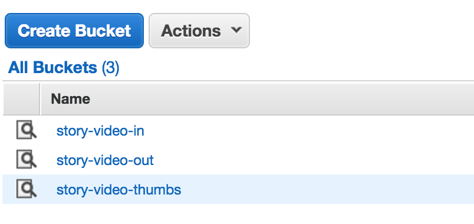
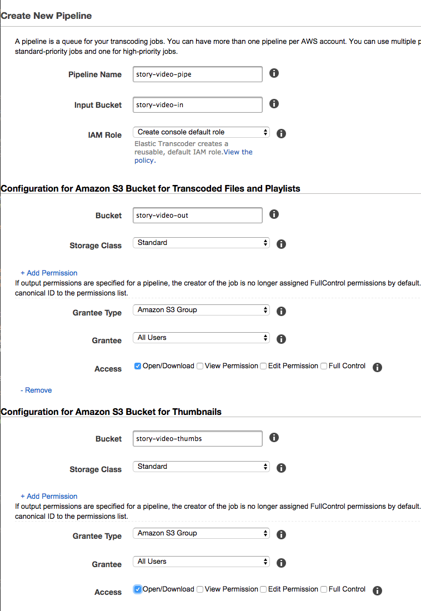
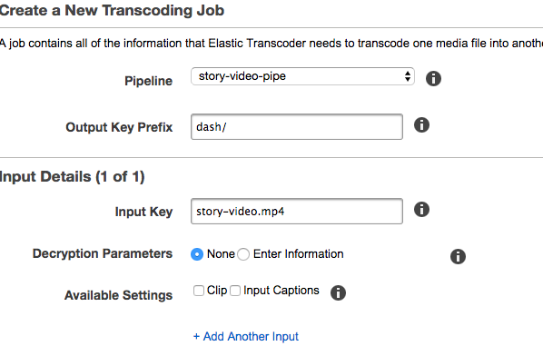
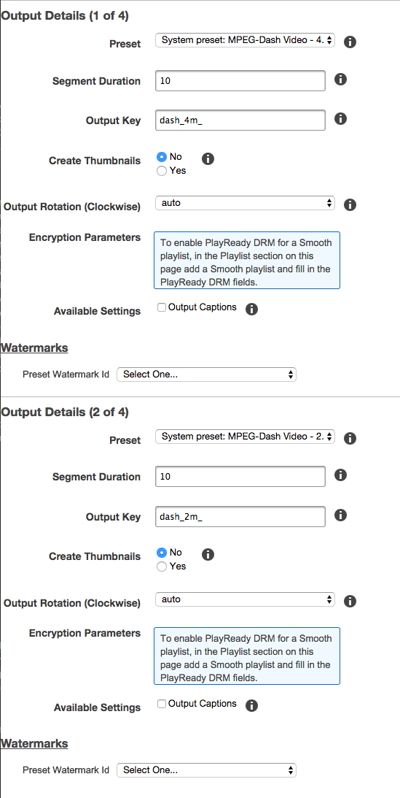
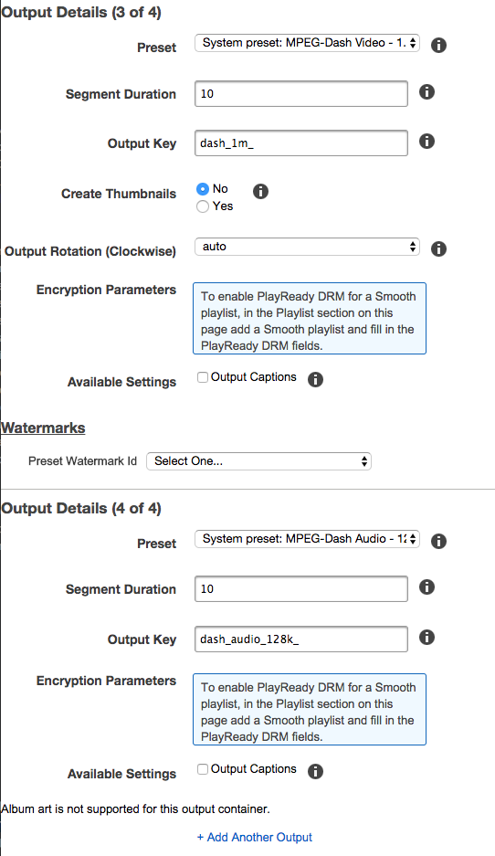
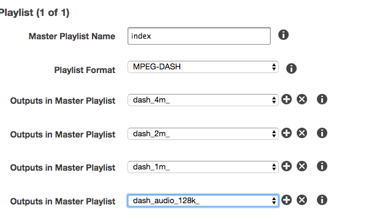
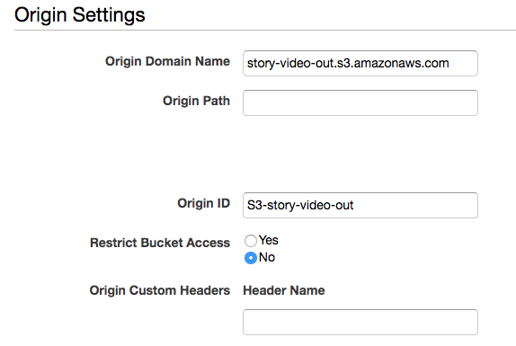
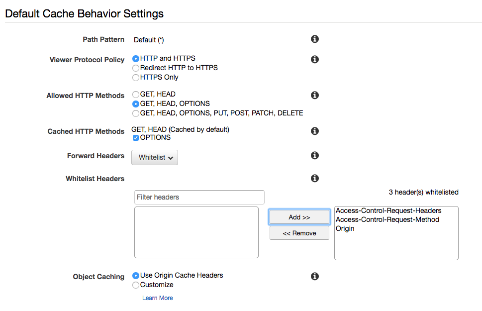

Adaptive Streaming has become the neccessity for streaming video and audio. Unfortantely, as of this post, there isn't a whole lot of tutorials that accumulate all of the steps to get this working. Hopefully this post achieves that. This post focuses on using Amazon Web Services (AWS) to transcode for HLS and DASH and be the Content Delivery Network (CDN) that delivers the stream to your web page. We'll be using Video.js for the HTML5 player as well as javascript support libaries to make Video.js work with HLS and DASH.

#### So Here's what you need:

-   [An AWS Account](https://aws.amazon.com/)
-   [Video.js](https://github.com/videojs/video.js/releases)
-   [videojs-contrib-hls.min.js](https://github.com/videojs/videojs-contrib-hls/releases/)
-   [dash.all.min.js](https://github.com/Dash-Industry-Forum/dash.js/releases)
-   [videojs-dash.min.js](https://github.com/videojs/videojs-contrib-dash/releases/)

### Set up three S3 buckets

In AWS go to their S3 service and create 3 buckets. You can name them whatever you want. I reccomend appending -in, -out, and -thumbs to each for easy organization.


### Upload your video

Upload your video to your _-in_ bucket. Then in your _-out_ bucket create 2 folders named: `dash` and `hls`

### Use the Elastic Transcoder

Under AWS Services navigate to the Elastic Transcoder.

Here we first need to create a new pipeline. Think of a the pipeline as a queue that connects your -in and -out buckets.



Now that we have a pipeline let's create a Job that will transcode our video for MPEG-DASH. If we created our outpute folders and uploaded our video correctly we should see them as options when we select the empty fields here. So start your job as so:



Now we need to specify how many different video quality segments we want for our streaming. This is where we define the bitrate magic that allows our video to stream different qualities based on a user's connectivity. First select the DASH preset for the highest quality. A good segment duration is 10 seconds. For the output key I like to use the naming convention you see in the screenshot. Repeat the process for the different DASH quality presets as well as for the audio preset. We can have the job created thumbnails here and output them to our -thumbs bucket but I'm going to ignore that step and upload my own thumbs manaually later.




Once we have all our presets we need to add them to a playlist which will be the manifest file (.mpd) which we are going to name `index`. This file is what we feed our video player in the javascript later.


Now run your job. Once it's complete you should see the output of your dash files and index.mpd file in the dash folder in your -out S3 bucket.

### Setup the CloudFront Distribution

With CloudFront we will use Amazon's CDN for delivering our content to the user based on the best Edge Server to their location. Under AWS Services navigate to CloudFront and Create a new distribution. Then select _Get Started_ for a _Web_ distribution.

For Origin Domain Name select your -out folder to be the origin. What's next is important. For Cache Behaviors be sure to select allowed HTTP Methods for GET, HEAD, OPTIONS and then check the OPTIONS box for Cached HTTP Methods. Then Whitelist Forward Headers as seen in the screenshot below. Everything else leave the defaults and create the distribution. It will take a little while (20-30 min) for CloudFront to process the distribution. Once it's finsihed you can access your files from your cloudfront domain name which will look something like: `https://d106r1lp4z33yd.cloudfront.net`




Lastly back in your S3 buckets, hilight your -out bucket and under it's Properties select the _Add CORS Configuration_ button and add the xml below to it. This allows your access to be cross origin.

```xml
<?xml version="1.0" encoding="UTF-8"?>
<CORSConfiguration xmlns="http://s3.amazonaws.com/doc/2006-03-01/">
    <CORSRule>
        <AllowedOrigin>*</AllowedOrigin>
        <AllowedMethod>GET</AllowedMethod>
        <MaxAgeSeconds>3000</MaxAgeSeconds>
        <AllowedHeader>*</AllowedHeader>
    </CORSRule>
</CORSConfiguration>
```

That's it for setting up our video for adaptive streaming. Now DASH has become a standard but as of this post Apple (_wave's fist_) uses their own format in HLS. We need to do this so we can support iOS devices. So repeat the process we did with DASH by transcoding for HLS. Use the `hls` folder for the output then select HLS-Video and HLS-Audio presets and use the HLS-v4 playlist option.

Example link to DASH manifest:

https://d106r1lp4z33yd.cloudfront.net/dash/index.mpd

Example link to HLS Manifest:

https://d106r1lp4z33yd.cloudfront.net/hls/index.m3u8

To test everything works you can try loading in the url to your manifest [Here](http://mediapm.edgesuite.net/dash/public/nightly/samples/dash-if-reference-player/index.html)

Know that AWS says it could take up to 24 hours for everything to propigate to all their CloudFront servers.

### Client Implemenation

```html
<html>
<head>
    <link href="/js/video-js/video-js.css" rel="stylesheet">
    <!-- If you'd like to support IE8 -->
    <script src="/js/video-js/ie8/videojs-ie8.min.js"></script>
</head>
<body>
    <video id="story_video" class="video-js vjs-default-skin vjs-16-9 vjs-big-play-centered" controls width="500" height="281" poster="">
        <p class="vjs-no-js">
            To view this video please enable JavaScript, and consider upgrading to a web browser that
            <a href="http://videojs.com/html5-video-support/" target="_blank">supports HTML5 video</a>
        </p>
    </video>

</body>

<script src="/js/video-js/video.js"></script>
<script src="/js/video-js-hls/videojs-contrib-hls.min.js"></script>
<script src="/js/video-js-dash/dash.all.min.js"></script>
<script src="/js/video-js-dash/videojs-dash.min.js"></script>

<script>
```

```javascript
//Optional Callback to disable debugging logging
var dashjsCallback = function(player, mediaPlayer) {
    // Log MediaPlayer messages through video.js
    if (videojs && videojs.log) {
        mediaPlayer.getDebug().setLogToBrowserConsole(false);
    }
};

//Add the Callback hook from above
videojs.Html5DashJS.hook("beforeinitialize", dashjsCallback);

var videoElement = document.getElementsByTagName("video")[0];

//check the browser headers to determine if coming from iOS or not
//and store result in isIOS var.
if (isIOS) {
    manifest = "hls/index.m3u8";
    mimeType = "application/x-mpegURL";
} else {
    manifest = "dash/index.mpd";
    mimeType = "application/dash+xml";
}

var myPlayer = videojs(videoElement, {
    controls: true,
    autoplay: true,
    preload: "auto",
    fluid: "true"
});
myPlayer.src({
    src: "https://d106r1lp4z33yd.cloudfront.net/" + manifest,
    type: mimeType
});

myPlayer.play();
```

```html
</script>
</html>
```

Boom. If you want to add a poster graphic for your video, upload a graphic to your _-thumbs_ S3 bucket and link like so:

```html
<video ... poster="link_here">.
```

Consider setting up a second CloudFront service to point to the -thumbs bucket and be sure to make the thumb image permission public.
